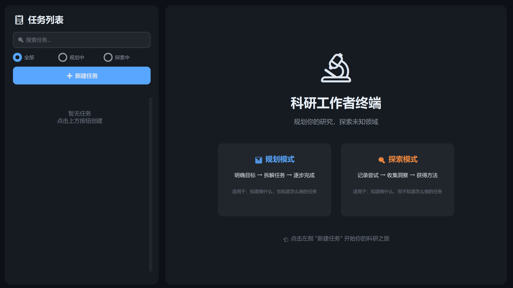
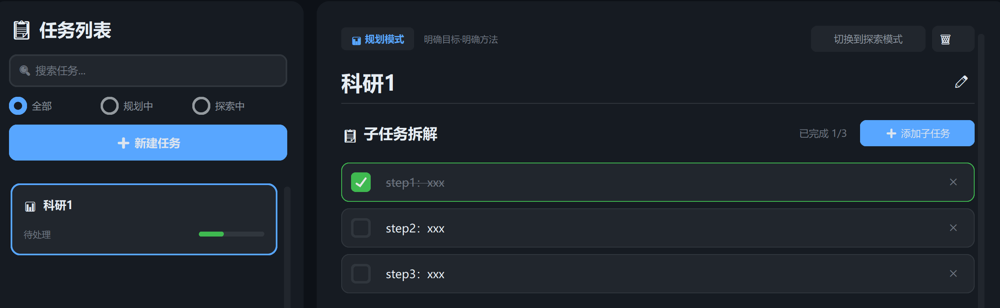
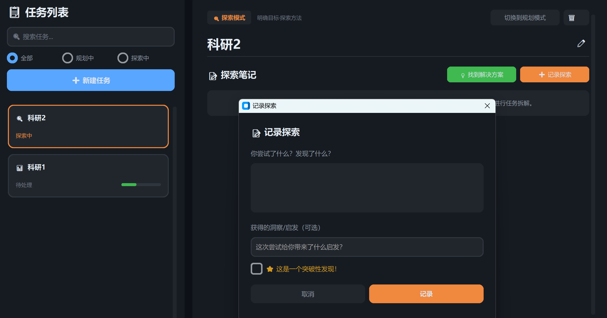

<div align="center">

# 🔬 Researcher Terminal

### 科研工作者终端

**专为科研人员设计的智能任务管理工具**

*在「规划」与「探索」之间自由切换，让科研工作更有序*

[](https://python.org)
[](LICENSE)
[]()

[English](#english) | [中文](#中文)

---

</div>

---

## 中文

### 🎯 核心理念

科研工作者的日常并非总是按部就班。我们观察到，科研工作存在两种截然不同的认知状态：

<table>
<tr>
<td width="50%" align="center">

**📊 规划模式**

*知道做什么，也知道怎么做*

当你目标明确、方法清晰时，
需要的是**任务拆解**和**进度追踪**

</td>
<td width="50%" align="center">

**🔍 探索模式**

*知道做什么，但不知道怎么做*

当你面对未知时，
需要的是**记录尝试**和**收集洞察**

</td>
</tr>
</table>

**Researcher Terminal** 正是为这两种工作状态而生。

> 📖 **深入了解设计理念**：[DESIGN_PHILOSOPHY.md](DESIGN_PHILOSOPHY.md)

---

### ✨ 功能特性

#### 📊 规划模式 - Planning Mode

> 适用于：论文写作、代码开发、实验执行等**方法明确**的任务

- 🔹 **任务拆解** — 将大目标分解为可执行的子任务
- 🔹 **进度可视化** — 实时追踪完成百分比
- 🔹 **有序推进** — 逐项完成，稳步前进
- 🔹 **结论沉淀** — 探索模式的发现可转化为规划依据

#### 🔍 探索模式 - Exploring Mode

> 适用于：方法论研究、技术调研、难题攻克等**需要摸索**的任务

- 🔸 **探索笔记** — 记录每一次尝试和发现
- 🔸 **洞察标记** — 高亮从失败中获得的启发
- 🔸 **突破标记** — 用⭐标记关键性发现
- 🔸 **方案沉淀** — 找到解决方案后一键转为规划模式

#### 🔄 灵活切换

- 任务可随时在两种模式间切换
- 探索阶段的所有笔记和结论都会保留
- 支持从「不知道怎么做」到「明确方法」的完整工作流

---

### 📸 界面预览

<div align="center">

| 欢迎界面 | 规划模式 | 探索模式 |
|:---:|:---:|:---:|
|  |  |  |

</div>

**设计特点：**
- 🌙 **深色学术风格** — 长时间工作护眼
- 📐 **左右分栏布局** — 任务列表 + 详情视图
- 🎨 **直观色彩标识** — 蓝色规划 / 琥珀探索 / 绿色完成

---

### 🚀 快速开始

#### 环境要求

- Python 3.10 或更高版本
- pip 包管理器

#### 安装步骤

```bash
# 1. 克隆仓库
git clone https://github.com/yourusername/researcher-terminal.git
cd researcher-terminal

# 2. 安装依赖
pip install -r requirements.txt

# 3. 启动程序
python main.py
```

#### 一键安装（可选）

```bash
pip install customtkinter Pillow && python main.py
```

---

### 📁 项目结构

```
researcher-terminal/
│
├── 📄 main.py              # 主程序入口与UI界面
├── 📄 models.py            # 数据模型（Task, SubTask, ExplorationNote）
├── 📄 database.py          # 数据持久化层（JSON存储）
├── 📄 requirements.txt     # Python依赖
├── 📄 README.md            # 项目说明
│
├── 📁 docs/                # 文档资源
│   └── screenshots/        # 界面截图
│
└── 📄 research_data.json   # 用户数据（运行后自动生成）
```

---

### 💡 使用场景

| 场景 | 模式建议 | 示例 |
|------|----------|------|
| 📝 论文写作 | 规划模式 | 拆解：摘要 → 引言 → 方法 → 结果 → 讨论 |
| 🧪 实验设计 | 探索模式 | 记录不同参数组合的尝试和效果 |
| 💻 代码开发 | 规划模式 | 功能模块逐一实现 |
| 📚 文献调研 | 探索模式 | 记录阅读发现，标记重要洞察 |
| 🔧 Bug修复 | 探索模式 | 记录排查过程，直到定位问题 |
| 📊 数据分析 | 两者结合 | 先探索分析思路，再规划执行步骤 |

---

### 🛠️ 技术栈

| 技术 | 用途 |
|------|------|
| **Python 3.10+** | 核心语言 |
| **CustomTkinter** | 现代化UI框架 |
| **Dataclasses** | 数据模型 |
| **JSON** | 轻量级本地存储 |

---

### 🗺️ 路线图

- [x] 核心功能：规划模式 & 探索模式
- [x] 任务CRUD操作
- [x] 子任务管理
- [x] 探索笔记系统
- [x] 模式切换
- [ ] 数据导出（Markdown/PDF）
- [ ] 标签系统 & 高级筛选
- [ ] 任务优先级排序
- [ ] 时间统计 & 番茄钟
- [ ] 多语言支持
- [ ] 云同步（可选）

---

### 🤝 贡献

欢迎提交 Issue 和 Pull Request！

1. Fork 本仓库
2. 创建特性分支 (`git checkout -b feature/AmazingFeature`)
3. 提交更改 (`git commit -m 'Add some AmazingFeature'`)
4. 推送到分支 (`git push origin feature/AmazingFeature`)
5. 开启 Pull Request

---

### 📄 许可证

本项目采用 Apache License 2.0 许可证 - 查看 [LICENSE](LICENSE) 文件了解详情


### 💬 联系

如有问题或建议，欢迎通过以下方式联系：

- 📧 Email: your.email@example.com
- 🐛 Issues: [GitHub Issues](https://github.com/yourusername/researcher-terminal/issues)

---

<div align="center">

**⭐ 如果这个项目对你有帮助，请给一个 Star！**

*专注科研，高效探索* 🎓

Made with ❤️ for Researchers

</div>

---

## English

### 🎯 Core Philosophy

Researchers don't always work in a predictable, linear fashion. We've identified two distinct cognitive states in research work:

| State | Description | Mode |
|-------|-------------|------|
| **Clear Goal + Clear Method** | Know what to do AND how to do it | 📊 **Planning Mode** |
| **Clear Goal + Unknown Method** | Know what to do but NOT how to do it | 🔍 **Exploring Mode** |

**Researcher Terminal** is designed for both states.

### ✨ Features

#### 📊 Planning Mode
- Break down complex tasks into subtasks
- Track progress with visual indicators
- Complete tasks systematically

#### 🔍 Exploring Mode
- Record each attempt and discovery
- Mark insights gained from experiments
- Highlight breakthrough findings with ⭐
- Convert to Planning Mode when solution is found

### 🚀 Quick Start

```bash
# Clone and install
git clone https://github.com/yourusername/researcher-terminal.git
cd researcher-terminal
pip install -r requirements.txt

# Run
python main.py
```

### 📄 License

Apache License 2.0 - See [LICENSE](LICENSE) for details.

---

<div align="center">

**Built for researchers, by researchers** 🔬

</div>
